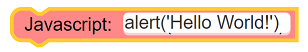
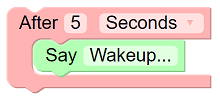

# Quando - Visual Programming for Digital Interactive Exhibits

## To Deploy in Windows - tested with Windows 10 Pro

Prerequisites: Firefox, Node JS, git for windows install (https://gitforwindows.org/)

1. Clone the repository in C: using git clone https://github.com/andrewfstratton/quando.git
2. In the command line, in C:\quando, npm update - this will likely take a while
3. you may need to rebuild the serial-port, if so, then:
    1. (may need) npm install --global --production windows-build-tools
    2. npm install serialport --build-from-source
4. Download blockly from github (most likely) and unzip into C:\quando\blockly

### Setting up Quando for first time use

1. Run quando (which runs node app.js)
2. Open (in a browser) the url 'http://127.0.0.1:5984/_utils'
    1. Create a database called 'user' (top right)
    2. Click the '+' to the right of All Documents
    3. Choose '+ New Doc'
    4. Ctrl-A -> Delete, then paste the next line in:
        1. {"_id": "test", "password": "test"}
    5. Then choose 'Create Document'
3. Then open 127.0.0.1/editor for the editor, login as test/test

### To add automatic startup
1. using Windows R, run gpedit.msc
2. Choose Computer Configuration->Windows Settings->Scripts->Startup
    1. Then 'Add' C:\quando\quando.bat
    2. Then 'Add' C:\quando\kiosk.bat to autostart firefox *(where you have a client display running on the server as well)*
#### Client browser setup
The following setup can be done (by itself) on any client machine - though kiosk.bat will need to be copied over

1. Open Firefox
    1. Press Ctrl-Shift-A
    2. Scroll down and choose 'See more add-ons!'
    3. Type 'mpt fullscreen' in the search box
    4. Select it and add it to firefox
    5. Press Ctrl-Shift-A
    6. Enable the Add on
    7. Alt F4 to exit
2. Run quando\kiosk.bat
    1. Then choose the interaction you want to automatically load on booting.
    2. You can right click the screen to go back to the client setup.
If everything is fine - then try restarting to see if everything boots correctly - and test remotely to be sure that you can edit remotely.

### Optional - Leap Motion
The standard Leap Motion (Orion) software needs to be installed on the Client PC, i.e. where the Leap motion is plugged in and where the browser will be run. The SDK is not needed.

Optional - npm install -g nodemon

To update (assuming quando has changed), First kill the Node.js process in the task manager,
then use:
git pull origin master
quando

## Editing as a Developer

The instructions below assume that you are using Visual Studio Code, though specifics are generally avoided.

Then run the editor, you need to:
1. Run the pouchdb database, using `npm run pouchd`
2. Run `node app.js`, e.g. through Launch
3. Open a Browser to 127.0.0.1/editor

To use a client, access 127.0.0.1/client from a browser. This will automatically re-open the last script. You can right click the display to go to a screen that allows you to select already deployed/created scripts - whichever one you open will be reopened next time you open 127.0.0.1/client. Note that _.js is special, and is the test script.

### Block Development

Developing new blocks can require several different, connected, pieces of Javascript. As an overview, there are a few expected areas where code needs to be developed (and blocks are designed):

1. The Block interface is designed in editor/quando_blocks
2. The generator javascript is written in editor/quando_blocks (attached to the interafce - unlike Blockly, where the two are defined separately)
3. Usually, a client api is added to client/quando_browser or a new script in client/devices.  This massively simplifies the generated code and also helps enormously with debugging (especially since the editor does not need reloading).

These steps are usually repeated (in an agile way), improvind g the interface (for the users) and extending the functionality.

#### Example text to speech

The example below shows how to build a block for text to speech, based on the exprimental (at the time of writing) SpeechSynthesis browser extension.

##### Test the initial Javascript

As an initial starting point, using the editor, drag in an Advanced->Javascript block  and type inside it `alert('Hello World!')`

  

Test this to see how it works. Then check the Code button to see what is generated.

_Note: Javascript blocks are useful for developing purposes, since code can be tested without building a generator. This also allows you to develop the api first, before designign the visual blocks - which may suit you better._

##### Create a simple block

Using VS Code (or your favourite editor...)

1. Open editor/quando_blocks.js
2. Scroll down to the bottom
3. Just before the line `} // self.addBlocks`, insert
```javascript
    let SAY_BLOCK = 'Say'
    self.defineMedia({
      name: SAY_BLOCK,
      interface: [
      ],
      javascript: (block) => {
        return 'alert("Hello World!")\n'
      }
    })
```
4. Save the file
5. Reload the editor - check in the Media block and drag in the new block and test it - also check the generated Code using the Code button.

##### Adding a parameter

The Block needs to have a (named) text input added to the interface:
1. Find the block again and change it to:
```javascript
    let SAY_BLOCK = 'Say'
>   let SAY_TEXT = 'Say text'
    self.defineMedia({
      name: SAY_BLOCK,
      interface: [
>       { name: SAY_TEXT, title: '', text: '...Something...' }
      ],
      javascript: (block) => {
>       let result = 'alert("' + quando_editor.getText(block, SAY_TEXT) + '")\n'
>       return result
      }
    }
```

Test this out, then try embedding it in something, e.g.:

  

##### Changing to speech

Next change the javascript generator to:
```javascript 
      javascript: (block) => {
        let say_text = quando_editor.getText(block, SAY_TEXT)
        let result = `window.speechSynthesis.speak(new SpeechSynthesisUtterance("${say_text}"))`
        return result + '\n'
      }
```

##### Putting in an api call

This is fine - but not particularily readable. Changing the speech library would cause issue s- and we need more functionality without building complex, hard to debug, code.

To add an api call - add it to client/quando_browser.js:
1. Jump to the bottom and add (before the final `})()`)
```javascript
  self.say = (sentence) => {
    let utter = new SpeechSynthesisUtterance()
    utter.text = sentence
    window.speechSynthesis.speak(utter)
  }
```
2. Test this with a javascript block calling `quando.say("hello")`
3. Change the generator to generate javascript for the new api:
```javascript
        let result = `quando.say("${say_text}")`
```

_Note: when you change the quando_browser.js, you can test from the editor or refresh a client browser window to reload.  **But** when you change a generator, you **MUST** refresh the editor._

##### Move speech into a device

The quando_browser.js is not the best place for this - this should be in a device.  So:
1. Create a new file in clients/devices called speech.js
2. Add in the following:
```javascript
(function () {
  var quando = this['quando']
  if (!quando) {
    alert('Fatal Error: speech.js must be included after quando_browser')
  }
  var self = quando.speech = {}
  self.utter = new SpeechSynthesisUtterance()

  self.say = function(sentence) {
    self.utter.text = sentence
    window.speechSynthesis.speak(self.utter)
  }
})()
```
3. Remove the say function from quando_browser.js _(this will revert to the original script)_
4. Add an include to client/client.htm, i.e. `    <script src="/client/devices/speech.js" type="text/javascript"></script>
`, just after the ubit.js include
5. Test with a javascript call to `quando.speech.say("Hello")`
6. Change the generator to generate a call to quando.speech.say

_Note: Historically, the client browser code used ES5 for backward compatibility in browsers, the editor uses ES6, assuming that a (decent) desktop browser will be used for editing. Porting to ES6 is preferred for the future_

##### Interrupting Speech

Currently, speech will be queued, which causes problems in at least two different ways:
1. For museums, the Display blocks will interrupt running video/audio and this behaviour should be the same for speech.
2. The queue for speech could grow and grow as speech is queued up due to interactions.

So, to match the current model, which seeks to reduce unexpected behaviour, the speech must be interrupted by new speech.

Unfortunately, it turns out that the experimental status of SpeechSynthesis means differences between Firefox and Chrome. Essentially, Chrome does not generate end events, for speech, reliably. So Firefox has become the required browser for Quando.  This also solves the auto play video/audio issues with Chrome.
