# Creating New blocks

Quando includes a menu of 'Inventor' blocks used to create new blocks.  All Inventor blocks are contained within a 'New' Block:

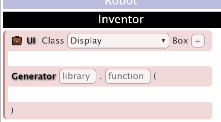

The Inventor blocks can be used to:
1. Create a new appearance for existing block/s
2. Create new Blocks including code generation
3. Create the initial interface and generator, with manual, advanced, editing

## Creating a new appearance

_Note: reading this section will help with the next section - creating new Blocks._

First, drag a New Block into the editor.  _If you 'Test' this, you should see a very short, empty, row in the colour of the Class chosen._

### Creating an Action Block UI - User Interface

Next drag in the Text Block and change the text to say 'Log':

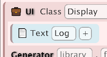

Then 'Test':

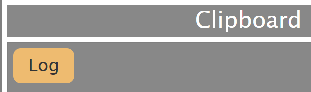

You can click the 'extras' '+' button to allow you to make the text _italic_ and/or **bold** or _iconify_ed - which adds a shadow.  Then Test the block...

_Try also adding 'standard' icons._

### Adding a block to be used

You should make sure the New block has 'block' generator selected, then drag in the Advanced log block:

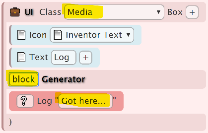

Save these blocks (or you will likely lose them - there is currently no undo in Quando).

Then use Test to create the new block and drag it into the editor. Then drag the Inventor blocks into the clipboard (you may accidentally delete them). You should have:

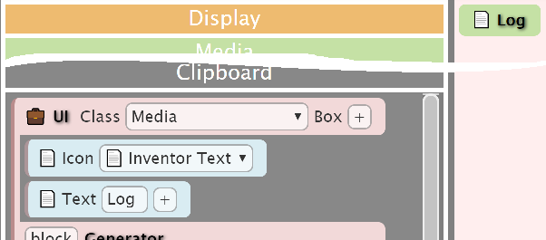

Now 'test' the interaction - the client window will open.  Open developer tools (Ctrl-Shift-I in Chrome) and you will see the console show 'Got here...'.

Now create the following interaction and test it - again looking in the developer tools console.

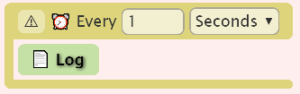

### User inputs

The Input Block allows editors to type in a string or number (see following).  The values have a name, which is then substituted using by putting the name in ```${...}```, e.g.

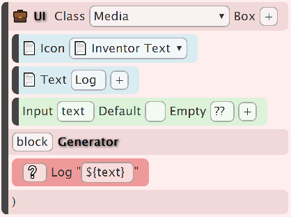

The 'empty' input will show a (slightly greyed out) note - but will still output an empty string:

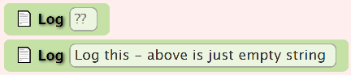

i.e. with this ouput:

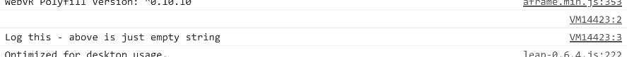

You can click the Code button to see the generated code - **This is very useful for debugging**
```
console.log('')
console.log('Log this - above is just empty string')
```

The input block can also be switched to number input in the extras - e.g. to allow a number from 0 to 100

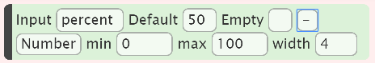

_Note that this will generate a number not a quoted 'string'_

### User selections

There are two selection blocks - Menu and Toggle blocks.  Both can only contain Choice blocks - which show the visible option and the value when selected.  The name of the menu and toogle is used to find the value (like with input blocks), e.g.

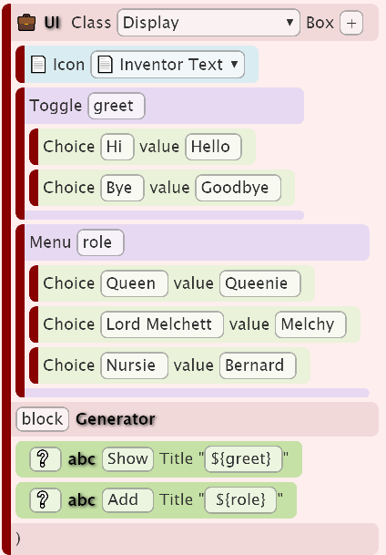

Will produce a block that could be set to

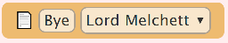

This will set the title to ```Goodbye Melchy```.

_Note: Toggle is usually used with 2 choices, occasionally three.  On Mobile Safari, Toggle may show as a menu._

# Adding new blocks to the editor

Inventor blocks can be saved and loaded as usual.  You can also view the Code and copy and paste the generated code into VS Code.  New blocks are held in the blocks directory, e.g. media blocks are held in blocks/11_media, where the number prefix is used to order the block menus in the editor.  Similarily, the block filenames are in the form 99_name.htm, e.g. 10_alert.htm orders the alert block (currently) at the top of the blocks in the Advanced menu.  **N.B. The filename, with the menu name, is used as a unique identifier for loading/saving blocks, e.g. 'advanced_alert' must be unique.**  The number prefixes can safely be changed for reordering.

Currently, to add a new block to the editor:

1. Use Code to shwo the generated code
2. Click in the text box, select all and copy
3. In VS Code (or other), in the blocks directory, choose the menu name - this should match the block 'class', e.g. 17_advanced
4. Right click and create a new filename.  The 2 digit prefix is used for ordering within the menu, e.g. 20, then put an underscore, then the unique (in the menu) name with underscore separators, followed by .htm, e.g. 22_leap_updown.htm
5. Paste in the code copied from the previous step
6. You can reformat (this will be easier to read)
7. The generated javascript may need line breaks removing
8. Save, then reload the editor and the block should appear

**N.B. Any errors in the generated html (e.g. when editing by hand) are likely to make the editor fail - check the browser console if you think this has happened.**
