# Creating New blocks

Quando includes a menu of 'Inventor' blocks used to create new blocks.  All Inventor blocks are contained within an Inventor 'UI' Block:


The Inventor blocks can be used to:
1. Create a new appearance for existing block/s
2. Create new Blocks including code generation
3. Create the initial interface and generator, with manual, advanced, editing

## Creating a new appearance

_Note: reading this section will help with the next section - creating new Blocks._

First, drag a UI Block into the editor.  _If you 'Test' this, you should see a very short, empty, row in the colour of the Class chosen._

### Creating an Action Block UI - User Interface

Next drag in the Text Block and change the text to say 'Log':


Then 'Test':


You can click the 'extras' '+' button to allow you to make the text _italic_ and/or **bold** or _iconify_ed - which adds a shadow.  Then Test the block...

_Try also adding 'standard' icons._

### Adding a block to be used

You should make sure the UI block has 'block' generator selected, then drag in the Advanced log block:


Save these blocks (or you will likely lose them).

Then use Test to create the new block and drag it into the editor. Then drag the Inventor blocks into the clipboard (you may accidentally delete them). You should have:


Now 'test' the interaction - the client window will open.  Open developer tools (Ctrl-Shift-I in Chrome) and you will see the console show 'Got here...'.

Now create the following interaction and test it - again looking in the developer tools console.


### User inputs

The Input Block allows editors to type in a string or number (see following).  The values have a name, which is then substituted using by putting the name in ```${...}```, e.g.


The 'empty' input will show a (slightly greyed out) note - but will still output an empty string:


i.e. with this ouput:


You can click the Code button to see the generated code - **This is very useful for debugging**
```
console.log('')
console.log('Log this - above is just empty string')
```

The input block can also be switched to number input in the extras - e.g. to allow a number from 0 to 100


_Note that this will generate a number not a quoted 'string'_

### User selections

There are two selection blocks - Menu and Toggle blocks.  Both can only contain Choice blocks - which show the visible option and the value when selected.  The name of the menu and toogle is used to find the value (like with input blocks), e.g.


Will produce a block that could be set to


This will set the title to ```Goodbye Melchy```.

_Note: Toggle is usually used with 2 choices, occasionally three.  On Mobile Safari, Toggle may show as a menu._

# Adding new blocks to the editor

Inventor blocks can be saved and loaded as usual.  You can also view the Code and copy and paste the generated code into VS Code.  New blocks are held in the blocks directory as a `.htm` file, e.g. media blocks are held in `1500_media.htm`, where the number prefix is used to order the block menus in the editor.  The blocks are then held in order inside the `.htm` file.  Each block contains a `data-quando-block-type` that is a unique identifier across all existing blocks (not just the menu), e.g. `data-quando-block-type="display-when-display"` where display-when-display must be unique within Quando, i.e. unique across all the `.htm` files in the blocks directory.  The order of blocks with `.htm` files and the number prefix for the `.htm` files can safely be changed for reordering.

Currently, to add a new block to the editor:

1. Use `Code` to show the generated code
2. Click in the text box, select all and copy
3. In VS Code (or other), in the blocks directory, choose the menu filename, e.g. `4500_advanced.htm`, edit this and paste in the code where you want it to appear in the menu.
6. You should reformat (this will be easier to read)
7. The generated javascript usually needs line breaks removing
8. Save, then reload the editor and the block should appear

**N.B. Any errors in the generated html (e.g. when editing by hand) are likely to make the editor fail - check the browser console if you think this has happened.**

# Example - adding browser gamepad blocks

When creating blocks, it is very common to create a duplicate of an existing API, which is not appropriate for non programmers.  So the Block design needs to take precedence.

For accessing a gamepad/controller, we want to start simple (minimal), so initially the focus will be on just button 'clicks', i.e. a block that detects only when individual buttons are pressed.

Options for the following will be designed/added later:

- releasing buttons
- holding buttons
- analogues values for triggers
- joystick values

Also for simplicity, currently only Xbox (360) Controller mapping will be allowed for.

## Block Design

A minimal block is created, using inventor blocks:

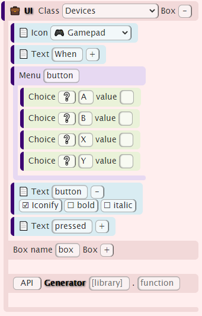

This looks like this:

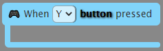

A quick update with some unicode 'circled' characters changes this to:

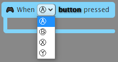

It would be nice to change these to coloured characters - but this is not part of the current inventor blocks, so would need to be edited by hand.  Also, the focus is currently on minimal - so moving on...

## Creating the generator

We need to make a few decisions about how the API will be called.  We need to have a name for the function; we will use `handleButton` and two parameters.  The first parameter is the button identifier, for which we will use the button index from the standard gamepad API as the identifier (see also https://w3c.github.io/gamepad/#remapping) since this is simple enough for our purpose.  The second parameter is to access the  `box` of contained blocks.

These updates can be seen below, where the API generator is also been added. **Note that the `box` callback has also been added as a parameter**:

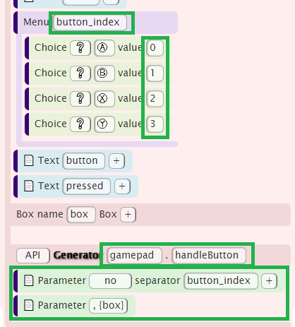

To deploy this to the editor, we need (currently) to:

1. Add the (unique) id as `devices-when-gamepad-button`.  _Note: this is not yet shown in the following code_
2. Use the Code button and copy the generated code
3. Paste the code into the `3500_devices.htm` file.

Note that the generated code is (currently incorrectly) spread across several lines:

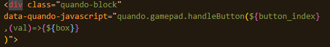

At the least, join these lines together so the string is all on one line - and it is also useful to ask your editor to reformat the document, giving:

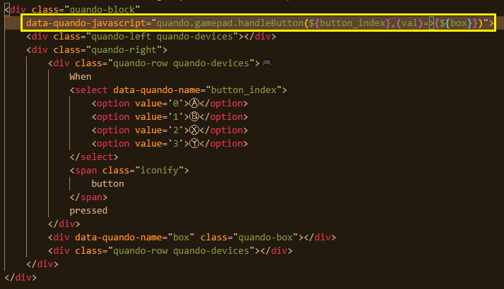

Once you have saved this, then you can refresh the editor and the block should be available in the Devices menu.

You can now drag and drop your blocks in the editor as if they are fully working and see how the blocks look - and go back and redesign if you need to:

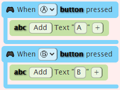

Of course, **this doesn't run yet** since you don't have an api implemented.

## Create a module and (empty) API

A new module needs to be created in `client/modules/` called `gamepad.js`.

Within this, we need to put a handleButton function (in the correct form) that takes a button_index and a callback.  Here is an initial setup to check that this works by just alerting when the initial calls are setup and when a gamepad is connected/reconnected:

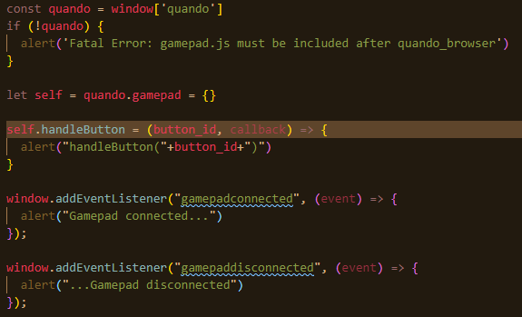

This modules needs to be linked (once only) in client/client.html:

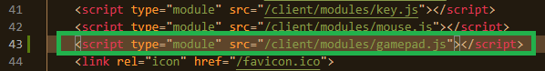

Now, without reloading the editor (since the block generator hasn't changed), you can test your block - though it won't do anything useful at this stage.

When you test the previous example, you will get two alerts, stating that handleButton has been called with 0 and 1 as parameters.  Note that this is the initial setup (which will add a handler) and not the actual callback based on a button being pressed...

Also, when you have a gamepad connected and then **click (any) button, while the browser is focused**, the gamepad will connect and show an alert.  The gamepad disconnected alert will show if you unplug a gamepad.

## Handling gamepad updates

Unfortunately the browser gamepad API doesn't allow for events, so we have to run a timer based loop to check for changes and then call the relevant code.

The whole code is shown below with highlighted areas described following.

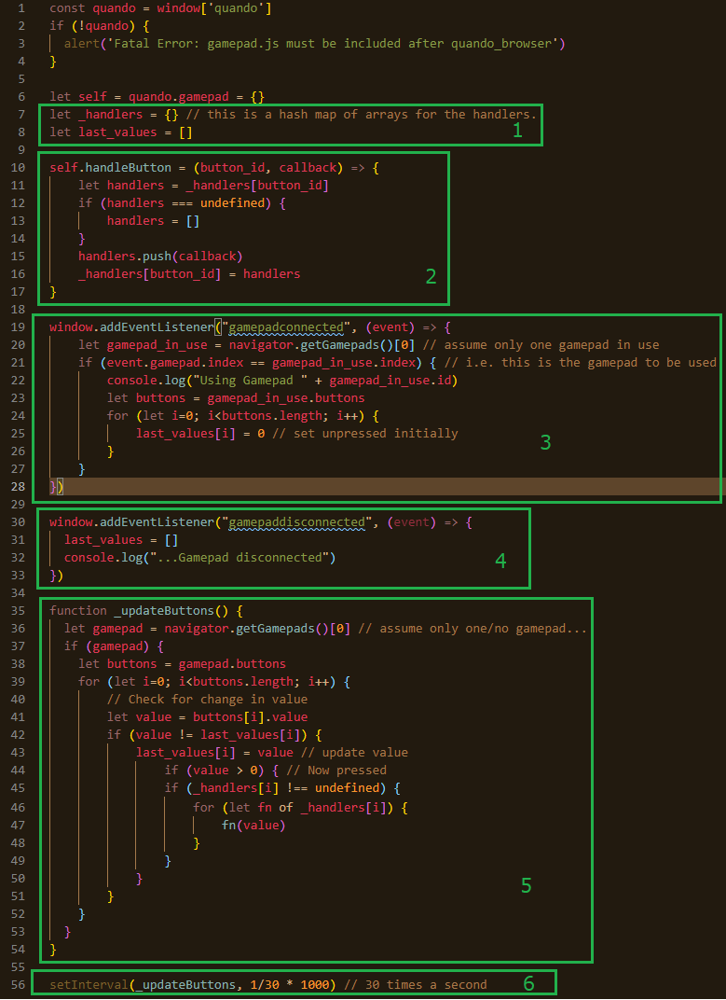

Notes on the listing:

1. These hold the (call back) handlers, i.e. the code contained by the block and the last value (state) of the gamepad buttons.
2. This adds a new call back to the list - this is the api call used to add contained actions.
3. The connected event sets up the last button value array
4. The disconnection removes the last button value array
5. Goes through any gamepad (just one presently) and detects where a button has become pressed and calls back the relevant handlers.
6. Calls the gamepad checking 30 times a second.

## Finally

To run the gamepad code, the (test) browser window needs to be refreshed, or just test again.

# Further enhancements

The next steps would likely include:

1. Testing the blocks with end users
2. Adding the rest of the buttons to the block .htm file (likely manually - in this case, it's quicker):

    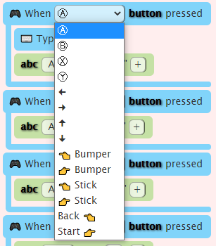

3. Adding the analogue values (sometimes just 0 or 1) for triggers - these give a range output from 0 to 1.
4. Adding the stick axes for X/Y.  These also give a range output.
5. Considering whether to design a hold/released option as well/instead that calls back when the button is first pressed and also calls back when the button is released.

Note: Quando includes extended gamepad blocks for buttons, joystick movement and triggers; the code is in the gamepad.js module and the generated blocks are in `3500_devices.htm`.  The included button block has been redesigned to allow for more buttons, as well as allowing the detection of button down, button up and button change (i.e. up or down) which is then passed back as a val (which can only be 0 or 1).
