# quandoscript
Script engine for Quando

Here is the (growing) script definition, where _xxx:: is the definition of xxx_

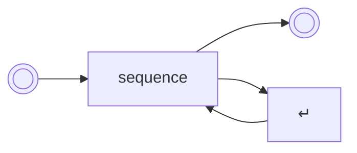

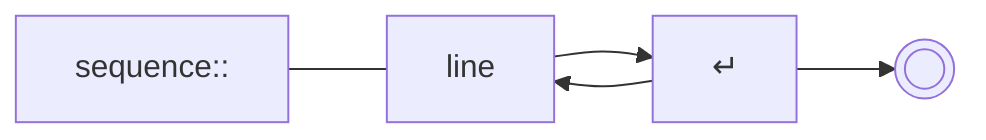

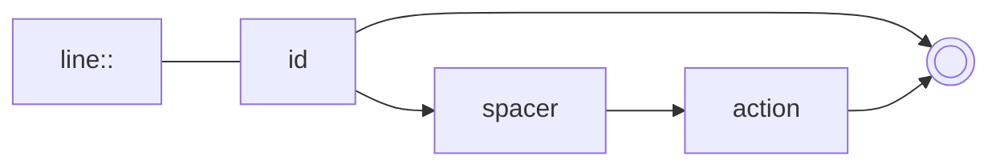

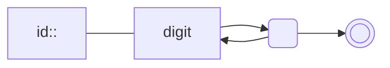

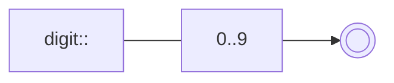

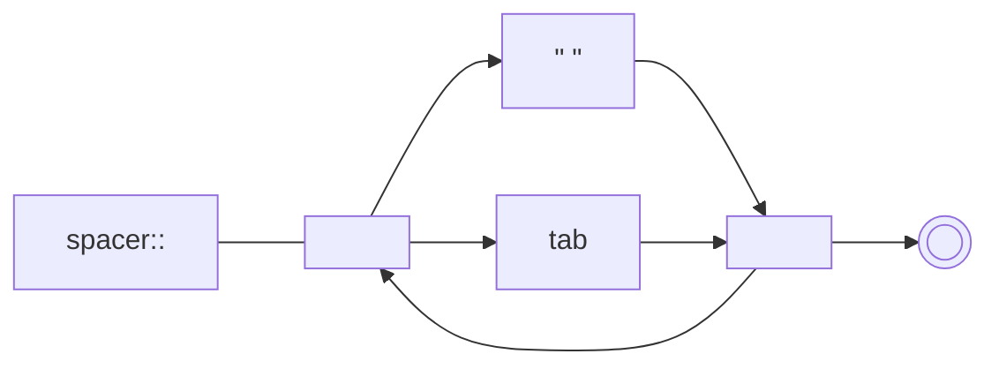

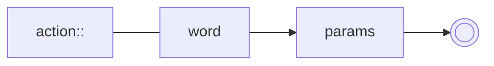

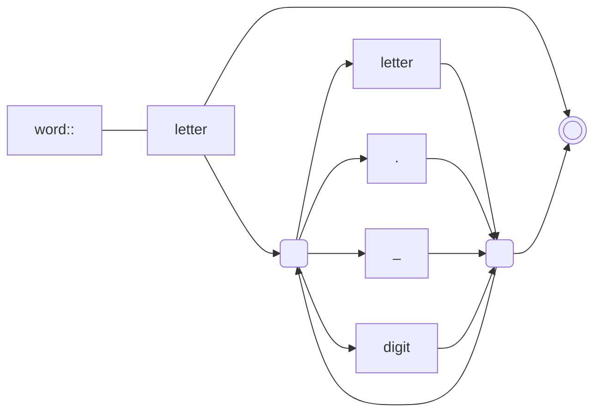

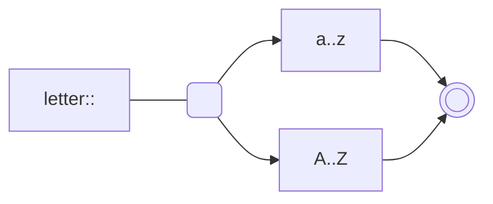

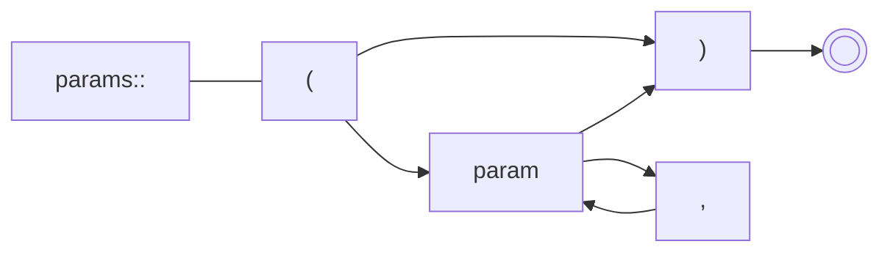

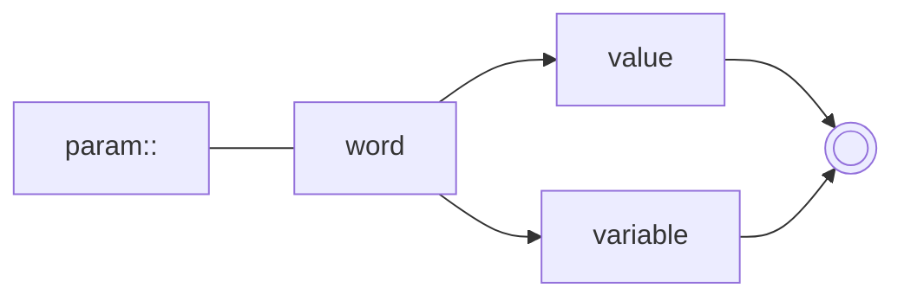

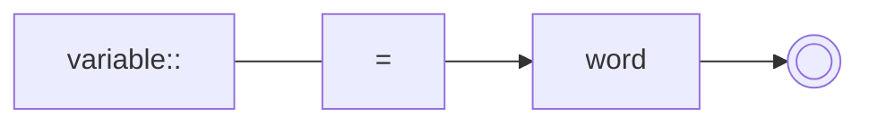

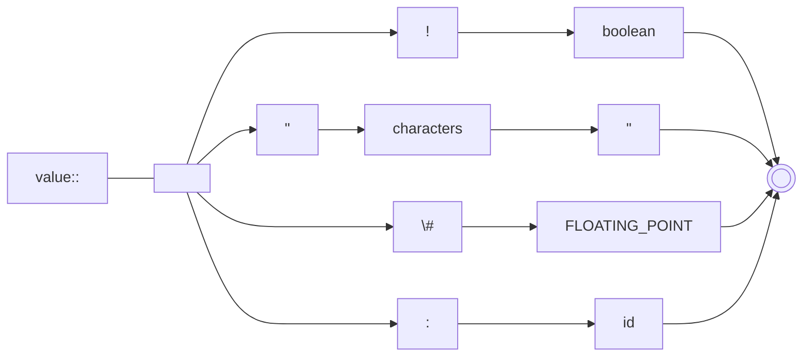

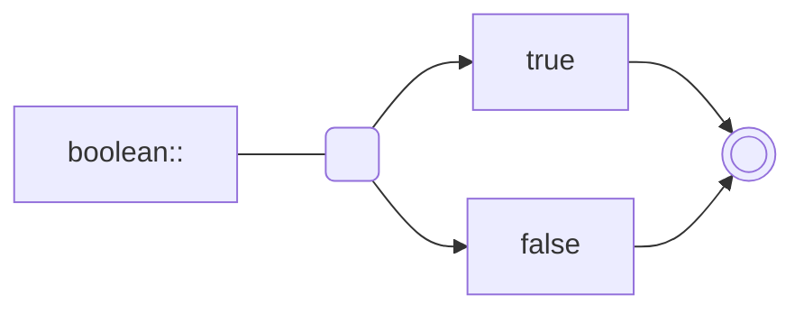

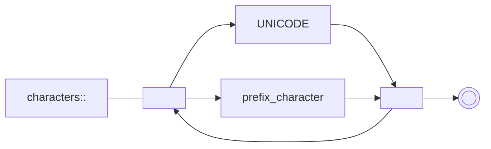

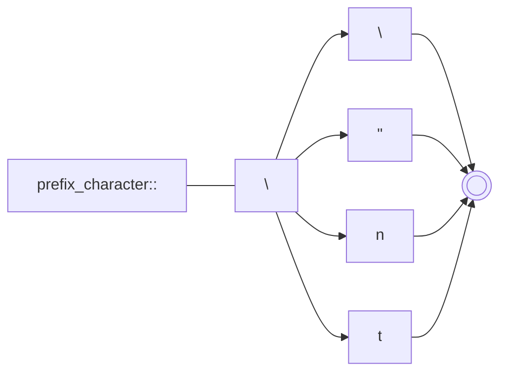

Optional

- Range
    - % full (0..1)
    - / half (0.5..1)
    - ~ plus_minus (0.5 +/- 0.5)
    - **or should I now switch to -1 to +1**
- true/false/either, e.g. for press/release/either
  - see also temporal logic
  - the difference here is between the press/release change of state and the actual press**ed**/releas**ed** state